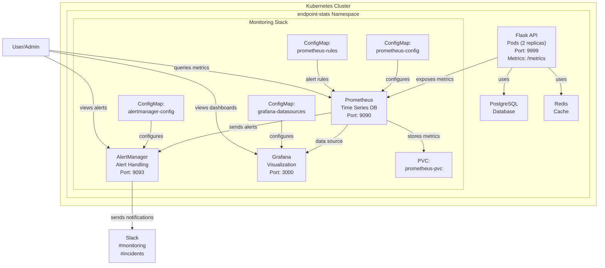

# Kubernetes Monitoring System Status

This document tracks the current status of the Kubernetes monitoring system implementation. Use this as a reference for context in future conversations.

## 1. Infrastructure Components

| Component | Status | Details |
|-----------|--------|---------|
| Kubernetes Cluster | ✅ Active | Minikube cluster running |
| Namespace | ✅ Created | `endpoint-stats` namespace configured |

## 2. Application Components

| Component | Status | Details |
|-----------|--------|---------|
| Flask API | ✅ Deployed | 2 replicas running on port 9999 with `/metrics` endpoint |
| PostgreSQL | ✅ Deployed | Running as a service on port 5432 |
| Redis | ✅ Deployed | Running as a service on port 6379 |

## 3. Monitoring Stack

| Component | Status | Details |
|-----------|--------|---------|
| Prometheus | ✅ Deployed | Running on port 9090 with persistent storage |
| AlertManager | ✅ Deployed | Running on port 9093 |
| Grafana | ✅ Deployed | Running on port 3000 with Prometheus data source |

## 4. Configuration Resources

| Resource | Status | Details |
|----------|--------|---------|
| prometheus-config | ✅ Created | ConfigMap with scrape configs and alerting settings |
| prometheus-rules | ✅ Created | ConfigMap with alert rule definitions |
| alertmanager-config | ✅ Created | ConfigMap with notification configurations |
| grafana-datasources | ✅ Created | ConfigMap with Prometheus data source |
| flask-api-secret | ✅ Created | Secret for Flask API credentials |
| prometheus-pvc | ✅ Created | PersistentVolumeClaim for Prometheus storage |

## 5. Alert Rules

| Rule | Status | Description |
|------|--------|-------------|
| HighErrorRate | ✅ Configured | Alerts when error rate > 10% for 5 minutes (critical) |
| SlowResponseTime | ✅ Configured | Alerts when 95p latency > 2s for 10 minutes (warning) |
| HighCPUUsage | ✅ Configured | Alerts when CPU > 80% for 15 minutes (warning) |

## 6. Service Discovery

| Method | Status | Details |
|--------|--------|---------|
| Kubernetes Pod Annotations | ✅ Configured | Using `prometheus.io/*` annotations for auto-discovery |
| Static Targets | ✅ Configured | Fallback configuration for Flask API |

## 7. Application Metrics

| Metric Type | Status | Details |
|-------------|--------|---------|
| Basic Flask Metrics | ✅ Exposed | `flask_http_request_total` counter available |
| Response Time Metrics | ❌ Missing | HTTP request duration metrics not implemented |
| Status Code Metrics | ❌ Missing | Detailed status code metrics not implemented |
| CPU/Memory Metrics | ✅ Available | Collected by Prometheus from Kubernetes |

## 8. External Integrations

| Integration | Status | Details |
|-------------|--------|---------|
| Slack Alerting | ⚠️ Partial | Configured but using placeholder webhook URL |

## 9. Network Access

| Service | Internal Access | External Access |
|---------|-----------------|----------------|
| Flask API | ✅ ClusterIP | ❌ Not exposed |
| Prometheus | ✅ ClusterIP | ❌ Not exposed (accessible via port-forward) |
| AlertManager | ✅ ClusterIP | ❌ Not exposed (accessible via port-forward) |
| Grafana | ✅ ClusterIP | ❌ Not exposed (accessible via port-forward) |
| PostgreSQL | ✅ ClusterIP | ❌ Not exposed |
| Redis | ✅ ClusterIP | ❌ Not exposed |

## 10. Missing Components/Improvements

1. Enhanced application metrics for more detailed monitoring
2. External access to monitoring tools (Ingress or LoadBalancer)
3. Proper Slack webhook URL configuration
4. Additional Grafana dashboards for application-specific metrics
5. User authentication for monitoring tools

## Architecture Diagram

## Last Updated

April 16, 2025
