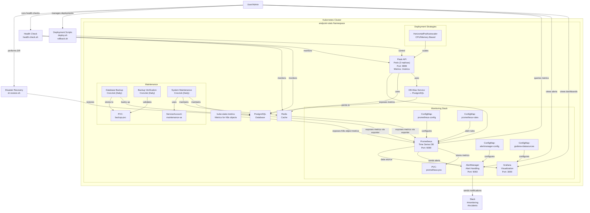

# Kubernetes Monitoring System Status

This document tracks the current status of the Kubernetes monitoring system implementation. Use this as a reference for context in future conversations.

## 1. Infrastructure Components

| Component | Status | Details |
|-----------|--------|---------|
| Kubernetes Cluster | ✅ Active | Minikube cluster running |
| Namespace | ✅ Created | `endpoint-stats` namespace configured |

## 2. Application Components

| Component | Status | Details |
|-----------|--------|---------|
| Flask API | ✅ Deployed | 3 replicas running on port 9999 with `/metrics` endpoint |
| PostgreSQL | ✅ Deployed | Running as a service on port 5432 |
| Redis | ✅ Deployed | Running as a service on port 6379 |
| Database Alias | ✅ Created | Service "db" pointing to PostgreSQL for application compatibility |

## 3. Monitoring Stack

| Component | Status | Details |
|-----------|--------|---------|
| Prometheus | ✅ Deployed | Running on port 9090 with persistent storage |
| AlertManager | ✅ Deployed | Running on port 9093 |
| Grafana | ✅ Deployed | Running on port 3000 with Prometheus data source |
| kube-state-metrics | ✅ Deployed | Running and exposing Kubernetes object metrics |
| Custom Dashboards | ✅ Created | Endpoint Statistics Dashboard configured |
| Custom Alerts | ✅ Configured | System and application-specific alerts defined |

## 4. Configuration Resources

| Resource | Status | Details |
|----------|--------|---------|
| prometheus-config | ✅ Created | ConfigMap with scrape configs and alerting settings |
| prometheus-rules | ✅ Created | ConfigMap with alert rule definitions |
| alertmanager-config | ✅ Created | ConfigMap with notification configurations |
| grafana-datasources | ✅ Created | ConfigMap with Prometheus data source |
| flask-api-secret | ✅ Created | Secret for Flask API credentials |
| prometheus-pvc | ✅ Created | PersistentVolumeClaim for Prometheus storage |
| kube-state-metrics RBAC | ✅ Created | ClusterRole and ClusterRoleBinding for kube-state-metrics |
| maintenance-sa | ✅ Created | ServiceAccount for maintenance jobs |

## 5. Alert Rules

| Rule | Status | Description |
|------|--------|-------------|
| HighErrorRate | ✅ Configured | Alerts when error rate > 5% for 5 minutes (critical) |
| SlowResponseTime | ✅ Configured | Alerts when 95p latency > 1s for 5 minutes (warning) |
| HighCPUUsage | ✅ Configured | Alerts when CPU > 80% for 10 minutes (warning) |
| DatabaseConnectionIssues | ✅ Configured | Alerts when PostgreSQL exporter is down (critical) |
| RedisConnectionIssues | ✅ Configured | Alerts when Redis exporter is down (critical) |
| PodRestartingFrequently | ✅ Configured | Alerts when pod restarts > 5 times in 1 hour (warning) |

## 6. Service Discovery

| Method | Status | Details |
|--------|--------|---------|
| Kubernetes Pod Annotations | ✅ Configured | Using `prometheus.io/*` annotations for auto-discovery |
| Static Targets | ✅ Configured | Fallback configuration for Flask API |
| ServiceMonitor | ✅ Configured | For kube-state-metrics, PostgreSQL, and Redis |

## 7. Application Metrics

| Metric Type | Status | Details |
|-------------|--------|---------|
| Basic Flask Metrics | ✅ Exposed | `flask_http_request_total` counter available |
| Response Time Metrics | ❌ Missing | HTTP request duration metrics not implemented |
| Status Code Metrics | ❌ Missing | Detailed status code metrics not implemented |
| CPU/Memory Metrics | ✅ Available | Collected by Prometheus from Kubernetes |
| Kubernetes State Metrics | ✅ Available | Node, pod, deployment, and other object metrics |

## 8. External Integrations

| Integration | Status | Details |
|-------------|--------|---------|
| Slack Alerting | ⚠️ Partial | Configured but using placeholder webhook URL |

## 9. Network Access

| Service | Internal Access | External Access |
|---------|-----------------|----------------|
| Flask API | ✅ ClusterIP | ❌ Not exposed |
| Prometheus | ✅ ClusterIP | ❌ Not exposed (accessible via port-forward) |
| AlertManager | ✅ ClusterIP | ❌ Not exposed (accessible via port-forward) |
| Grafana | ✅ ClusterIP | ❌ Not exposed (accessible via port-forward) |
| PostgreSQL | ✅ ClusterIP | ❌ Not exposed |
| Redis | ✅ ClusterIP | ❌ Not exposed |
| kube-state-metrics | ✅ ClusterIP | ❌ Not exposed (accessible via port-forward) |

## 10. Deployment Strategies

| Strategy | Status | Details |
|----------|--------|---------|
| Rolling Updates | ✅ Implemented | Deployment with maxSurge=1, maxUnavailable=0, health probes and resource limits |
| Horizontal Pod Autoscaler | ✅ Implemented | CPU and memory-based autoscaling (2-10 replicas) |

## 11. Deployment Scripts

| Script | Status | Details |
|--------|--------|---------|
| deploy.sh | ✅ Created | Script for deploying new versions with proper annotations |
| rollback.sh | ✅ Created | Script for rolling back to previous versions or specific revisions |

## 12. Maintenance

| Component | Status | Details |
|-----------|--------|---------|
| Database Backup | ✅ Implemented | Daily database backups with 10-day retention |
| Backup Verification | ✅ Implemented | Daily validation of most recent backup |
| System Maintenance | ✅ Implemented | Daily maintenance tasks for database, Redis, and logs |
| Health Check Script | ✅ Created | Comprehensive system health check script |
| Disaster Recovery | ✅ Documented | DR plan and restoration script implemented |
| Performance Tuning | ✅ Documented | Tuning guide for database and application optimization |
| Capacity Planning | ✅ Documented | Resource projections and scaling guidelines |
| Log Retention | ✅ Documented | Policy for various log types and retention periods |

## Architecture Diagram

## Last Updated

April 20, 2025

# Project Status

## Current Progress

1. ✅ Verified health of the deployment:
   - Flask API deployment is running with appropriate replicas
   - Service responds correctly to health checks
2. ✅ Fixed Docker image issue with Flask API deployment:
   - Built and loaded endpoint-stats:v2 image into Minikube
   - Redeployed Flask API with correct image

## Issues Encountered

1. HPA metrics collection occasionally shows delay in reporting
2. ✅ Fixed: Flask API pods were failing with ErrImageNeverPull because the image endpoint-stats:v2 was missing

## Completed Items

1. ✅ Verified system health with health check script
2. ✅ Built and loaded Docker image for Flask API deployment

## Next Steps

1. Set up automated health checks for deployments
2. Consider implementing a CI/CD pipeline for building and loading Docker images into Minikube

## Known Issues
- HPA currently shows \<unknown\> for CPU and memory metrics (waiting for metrics to be collected)
- Application lacks detailed response time and status code metrics
